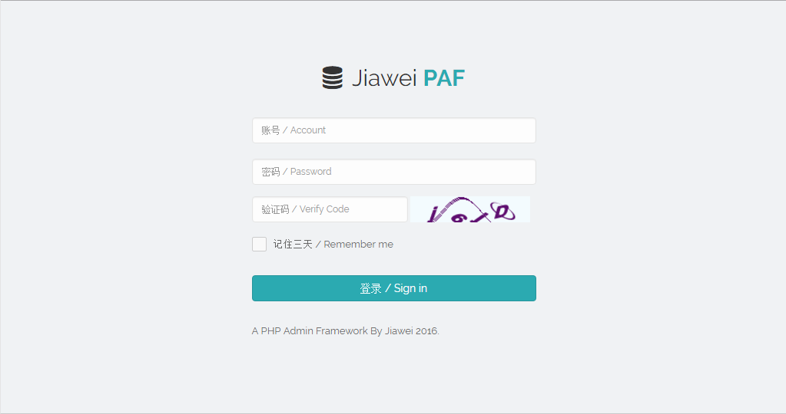
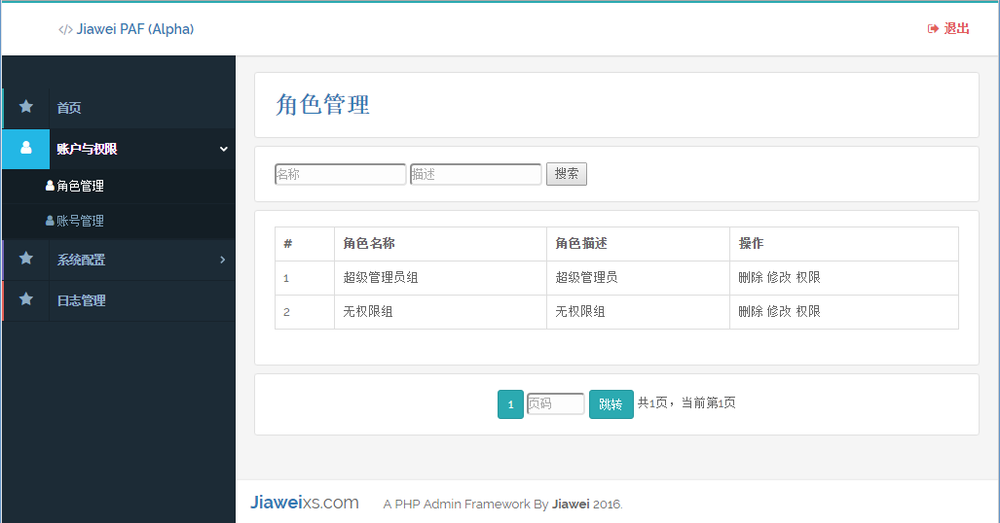

## 简介

&nbsp;&nbsp;&nbsp;&nbsp;Jiawei PHP Admin Framework 是一个基于ThinkPHP和Bootstrap的简约美观大方的轻量级PHP后台快速开发框架。
&nbsp;&nbsp;&nbsp;&nbsp;已实现基本功能，方便PHP后台的快速开发。

## 集成的功能

1. 登录界面
2. 后端界面(基于Bootstrap开发简约美观大方)
3. 账号管理
4. 角色管理
5. 权限控制
6. 节点管理(用于控制权限)
7. 菜单管理(实现不同角色不同菜单)与生成
8. 页面分页(已封装方法)
9. 日志功能
10. cookie的加解密

## 界面效果

## 待实现功能
[]新增功能
[]修改功能
[]权限更改

## 功能方法调用
下面解释怎么使用cookie加解密、分页功能 和 日志功能。

（printing）

